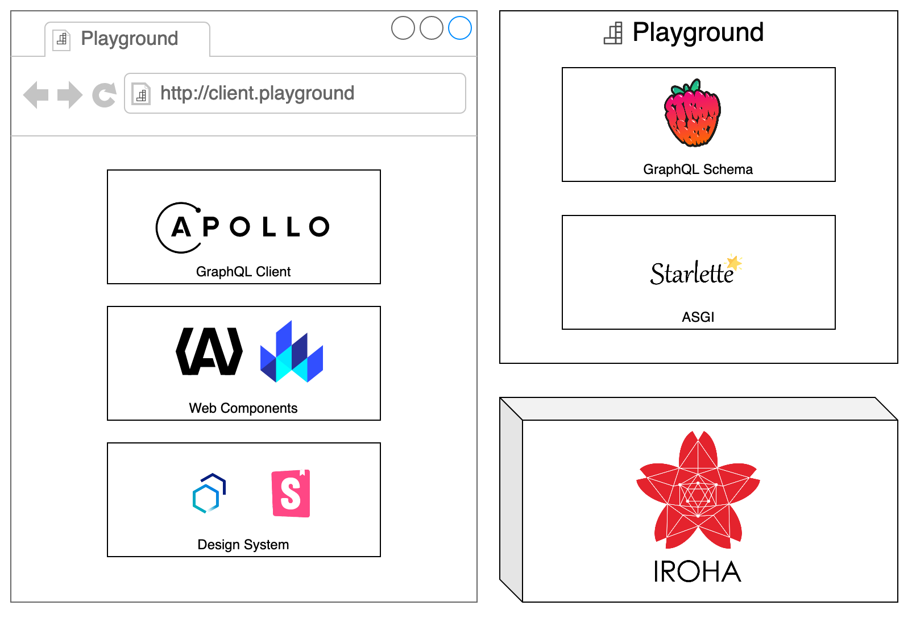

<h1>
     Playground</strong>
</h1>
<p>Playground for Hyplerdger Iroha.</p>

<p>
    <a href="https://github.com/dmtrs/iroha-playground" target="_blank">
        
    </a>
        
        
    <br />
    
</p>

**3 July 2021 / News:** 🎫 Under preparation of [backlog](https://github.com/dmtrs/iroha-playground/issues) and adhoc grooming/requirements to aim for a [MVP](https://github.com/dmtrs/iroha-playground/milestones) milestone.


## Intro to Hyperledger Iroha

> Hyperledger Iroha is a simple blockchain platform you can use to make trusted, secure, and fast applications by bringing the power of permission-based blockchain with Crash fault-tolerant consensus. It’s free, open-source, and works on Linux and Mac OS, with a variety of mobile and desktop libraries. 

See more: [hyperledger/iroha](https://github.com/hyperledger/iroha)

## Playground

Playground enables interaction with Hyperledget Iroha v1 API through a GraphQL interface. Domain graph introduced is enhancing current API and enables web components to visually communicate state of the blockchain.

### Technologies



## Development resources
- [Apollo Web Component Libraries: LitElement](https://apolloelements.dev/api/libraries/lit-apollo/)
- Carbon Design System
  - [Web Components Framework](https://www.carbondesignsystem.com/developing/frameworks/web-components)
  - [List of available components](https://web-components.carbondesignsystem.com/?path=/story/introduction-welcome--page)
- [Storybookjs documentation](https://storybook.js.org/docs/react/get-started/introduction)

- [Strawberry GraphQL documentation](https://strawberry.rocks/docs)
- Hyperledger Iroha
  - [What is inside Iroha?](https://iroha.readthedocs.io/en/main/concepts_architecture/architecture.html)
  - [Core concepts](https://iroha.readthedocs.io/en/main/concepts_architecture/core_concepts.html)
  - [API Reference](https://iroha.readthedocs.io/en/main/develop/api.html)
  - [Python Client examples](https://github.com/hyperledger/iroha-python/tree/master/examples)

### Bootstrap

```
docker-compose up --detach
```

Graphql server under: `http://localhost:8000`

### Local image

```
docker build -t iroha-playground
docker run -v $(pwd):/usr/src/app --rm -ti iroha-playground poetry run python keygen.py --name {KEY_NAME_HERE}
docker run -v $(pwd):/usr/src/app --rm -ti iroha-playground poetry run ptw -- --mypy playground --cov=playground --cov-report=term-missing:skip-covered --cov-report=xml tests/unit
```

## Misc
- [iconset](https://www.iconfinder.com/iconsets/kid-playground-and-toys)
